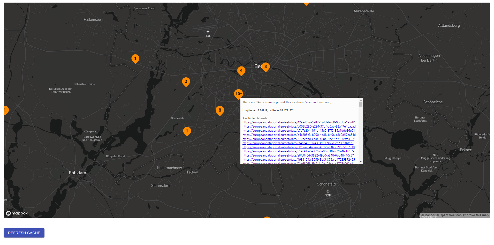

# Show-Geo
Show Geo project displays the available datasets at https://www.europeandataportal.eu/en on a map.  
This is done by querying the <a href="https://www.europeandataportal.eu/sparql">sparql enpoint</a> of the portal, where it looks for the available spatial data. Since the available spatial data is in form of coordinates of a Polygon, it averages the latitude and longitude values to derive the center coordinate. At this coordinate a pin is placed on the map with the Urls of the respective datasets available (URI on hover). When clicked, the pin will open the list of all the datasets as hyperlinks available at this point. Dataset hyperlinks can be clicked to open the dataset webpage.
## How to operate
The user interface would look something like this:   
<kbd>
  
</kbd>
  
You can zoom in and out of map using the mouse scroll. Also, you can move inside the map by dragging it. The data is loaded from the server cache. To refresh the data, please click the "Refresh Cache" button. An hourglass icon appears next to the "Refresh Cache" button when it is clicked. Cache is refreshed when the icon disappears.  
<b>Please Note:</b> Refreshing the cache takes some time (around 15-20 seconds).
## Pre-requisites
Please make sure you have the following installed on your local system before proceeding to the next step:
* <a href="https://www.oracle.com/java/technologies/javase-downloads.htmll">Java</a> version 8 or higher
* <a href="https://nodejs.org/en/download/">Node</a> version 10 or higher
* <a href="https://maven.apache.org/download.cgi">Maven version 3.6</a> or higher
## How to Run locally
First, clone the project in your local system by executing the following command on your command line:  `git clone https://github.com/nikit91/opal-hackathon.git`  

Local deployment is done in two parts:
* Rest Service Deployment
* User Interface Service Deployment

### Rest Service Deployment
Change your current directory to `show-geo-rest/` by executing `cd show-geo-rest`  . Then run the following commands:
* `mvn clean install`
* `mvn spring-boot run`

As this program first fetches the data from the sparql endpoint, it might take 15-20 seconds to start. Please wait for the message `Server Started Successfully` before proceeding to the next step.  
Upon successful deployment the rest service would start listening to the port `8080` by default.

### User Interface Service Deployment
Change your directory to `show-geo-react/` by executing `cd show-geo-react`  . Then run the following commands:
* `npm install`
* `npm start`

The application will open automatically on your default browser when the user interface is successfully deployed. By default the user interface listens to port `3000`.
